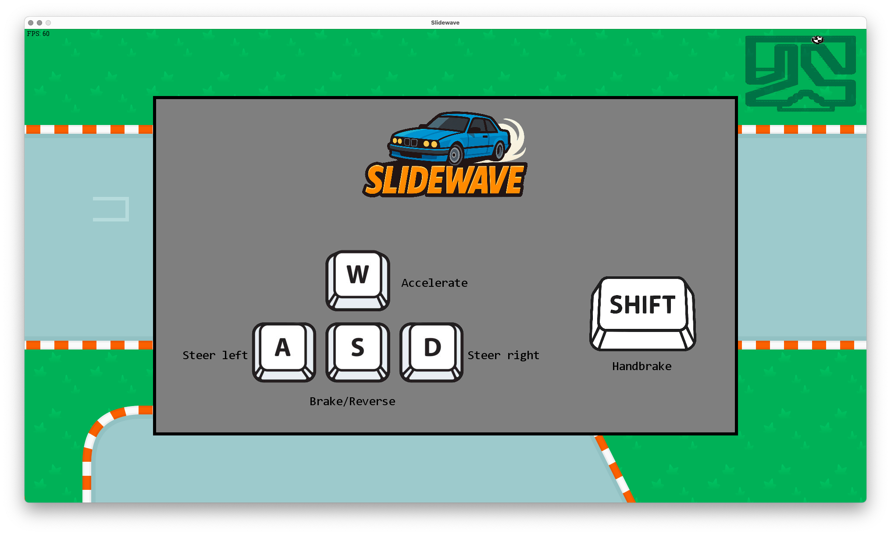
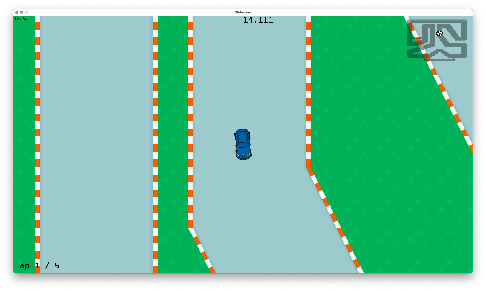
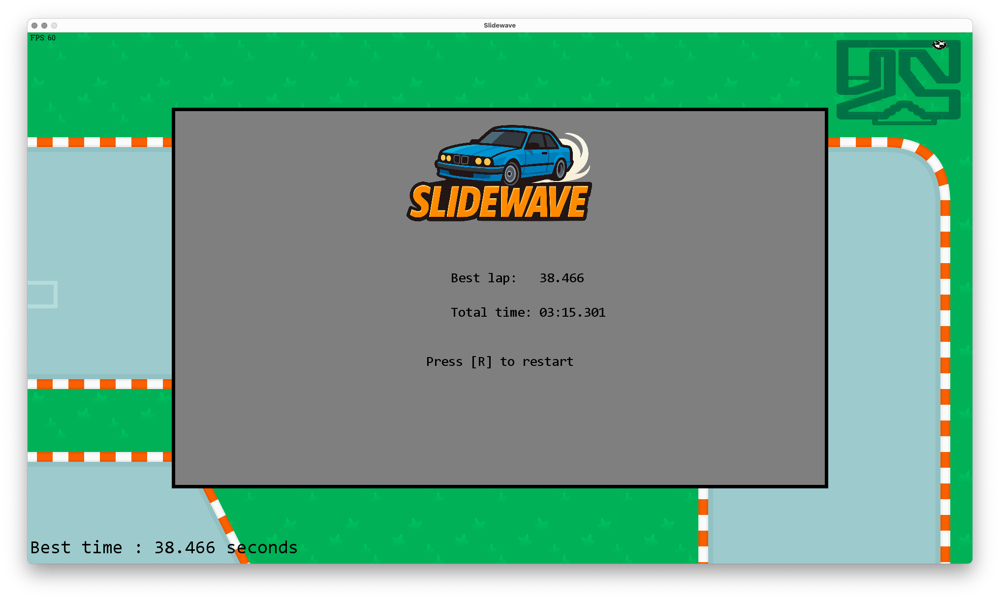

# Slidewave
## Description
Slidewave est un jeu de course de voitures en vue top-down en Scala utilisant gdx2D.

## Objectifs
Le but de ce jeu serait de apprendre à simuler des vraies mécaniques dans un jeu/appli.

**Objets à intégrer du plus au moins important:**
- Voiture se déplaçant avec caméra qui suit ✅
- Circuit ✅
- Gestion des temps (+ checkpoints) / Sauvegarde meilleurs scores ✅
- Minimap ✅
- Main menu ✅
- Course d'obstacles

**Bonus:**
- Fantôme (course contre la montre de son propre meilleur score)
- Compatibilité manette
- Simulation adhérence / drift facilité ✅
- Simulation autres joueurs (BOTs)
- Autres circuits
- Skins de voiture

## Manuel
Le jeu est simple d'utilisation.

Voici l'écran d'accueil du jeu :

On peut y voir les touches à utiliser :
- `W` : accélérer
- `A` : tourner à gauche
- `S` : tourner à droite
- `D` : freiner/reculer
- `SHIFT` : tirer le frein à main

Pour démarrer la partie, il suffit d'avancer.

Une fois la ligne de départ franchie, le chronomètre se lance.
Le temps du tour actuel est affiché en haut au milieu de l'écran et le compteur de tour en bas à droite :

Pour qu'un tour soit validé, il faut le finaliser sans sortir les 4 roues en même temps du terrain.
Auquel cas il faudra revenir au départ pour recommencer le tour.

Une fois tous les tours effectués, l'écran de fin apparaît et montre le temps du meilleur tour ainsi que le temps total des tours cumulés :

Pour relancer, il suffit d'appuyer sur la touche `R`.
